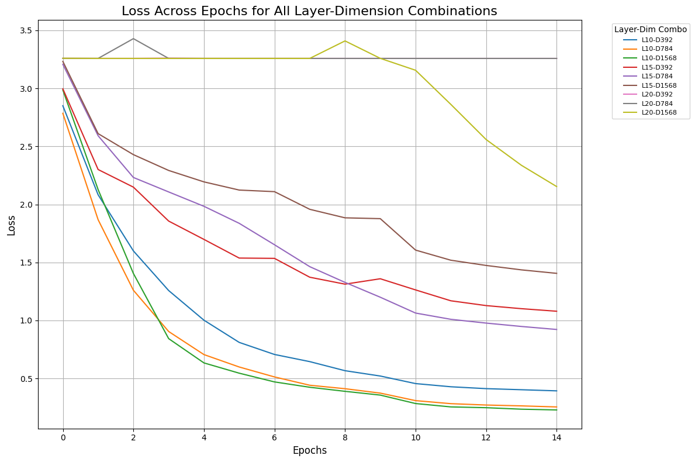
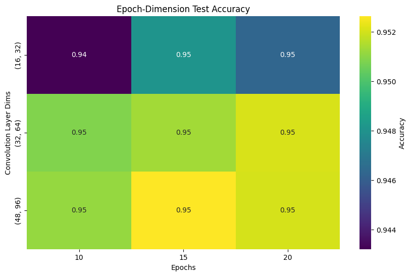

# COMP 562 Final Project

Group Members: Prajwal Moharana, Pranav Kallem, Tejas Chandramouli, Jayden Lim

Problem: What is the optimal machine learning method to predict letters from images?

### Approach:

Fine-tune a MLP, a CNN, and classical machine learning techniques on the EMNIST dataset to find optimal hyperparameters, then evaluate each optimized model's performance to determine which method is superior.

## MLP

Hyperparameters:

- input dimensions: 28 x 28
- number of epochs: 15
- learning rate: 0.001
- hidden layers: 10, 15, and 20 (we tested 3 different architectures)

Final Accuracy

1. 10 layer
   - 392 dim: 0.89
   - 784 dim: 0.91
   - 1568 dim: 0.92
2. 15 layer
   - 392 dim: 0.6
   - 784 dim: 0.73
   - 1568 dim: 0.43
3. 20 layer
   - 392 dim: 0.037
   - 784 dim: 0.037
   - 1568 dim: 0.2

Our results are consistent with those described in the paper "Deep Residual Learning for Image Recognition" showing that at some point the deeper the network is, the more difficult it is to train. In contrast, we see that for each layer count (10, 15, 20), adding more hidden dimensions will usually increase the accuracy.

## Convolutional Neural Network (CNN)

Hyperparameters:

- hidden dimensions: 1. (16, 32), 2. (32, 64), 3. (48, 96)
- number of epochs: 10, 15, 20
- learning rate: 0.001
- Architecture:

1. Input Layer
2. Convolutional Layer 1: 4x4 kernel, 1x1 padding, 1x1 stride
3. Batch Normalization 1
4. ReLU Activation Function 1
5. Max Pooling 1: 2x2 kernel, 1x1 stride
6. Convolutional Layer 2: 4x4 kernel, 1x1 padding, 1x1 stride
7. Batch Normalization 2
8. ReLU Activation Function 2
9. Max Pooling 2: 2x2 kernel, 1x1 stride
10. Convolutional Layer 3: 4x4 kernel, 1x1 padding, 1x1 stride
11. Batch Normalization 3
12. ReLU Activation Function 3
13. Max Pooling 3: 2x2 kernel, 2x2 stride
14. Output Layer

Final Accuracy

1. (16, 32)
   - 10 epochs: 0.94
   - 15 epochs: 0.95
   - 20 epochs: 0.95
2. (32, 64)
   - 10 epochs: 0.95
   - 15 epochs: 0.95
   - 20 epochs: 0.95
3. (48, 96)
   - 10 epochs: 0.95
   - 15 epochs: 0.95
   - 20 epochs: 0.95

Our results show that the greater the epochs and convolutional layer dimensions, the greater the overall accuracy is. It appears that the accuracy plateaus around 0.95.

## Classical Machine Learning Techniques

Techniques explored: logistic regression, random forest, and qda

#### Accuracy:

Logistic Regression

- 0.718125
- w/ PCA: 0.722293

Random Forest

- 0.886442
- w/ PCA: 0.845769

Quadratic Discriminant Analysis (QDA)

- 0.040913
- w/ PCA: 0.827451

### Notes

- Performed PCA to reduce the dimensionality of the data and we are able to explain 95% of the data with just 113 components which an 85% reduction in the dimensions
- Logistic regression and random forest performed similarly but QDA performed much better

## Results:

From our research on these methods, we conclude that a CNN with a (32, 64) or (48, 96) hidden dimension parameters with our specified architecture outperforms all classical machine learning methods by a noticeable margin with an impressive accuracy of 0.95 on 10 epochs. While the MLP's performance follows closely behind, the CNN provides a means for robust prediction of letters from the EMNIST dataset and generalizes to new data better than other methods. See our final report for more details!
